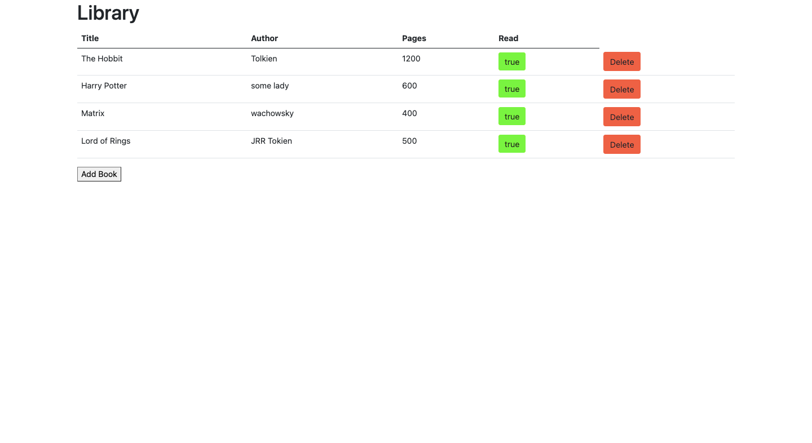

# Library

> The project was aimed to build a list of books of which you can check-box whether you've reading them yet or not, and delete them from the list.

Additional description about the project and its features.

## Built With

- Javascript
- Bootstrap

## Getting Started

Open your terminal and cd where you want to store the project
Run the following command - git clone https://github.com/luisvinicius09/jsLibrary
Cd into the directory - cd Library
Open the live server on your VScode Alt + L then Alt + o
To get a local copy up and running follow these simple example steps.

## Authors

👤 **Luis Vinicius Marques**

- GitHub: [@luisvinicius09](https://github.com/luisvinicius09)
- LinkedIn: [LinkedIn](https://linkedin.com/in/luis-vinicius)

👤 **German Aquila**

- GitHub: [@realisticattorney](https://github.com/realisticattorney)
- Twitter: [@ContoliAxl](https://www.twitter.com/contoliaxl)
- Linkedin: [@germanaquila](https://www.linkedin.com/in/german-aquila-55a9171b5/)

## 🤝 Contributing

Contributions, issues, and feature requests are welcome!

Feel free to check the [issues page](../../issues/).

## Show your support

Give a ⭐️ if you like this project!

## Acknowledgments

- Hat tip to anyone whose code was used
- Inspiration
- etc

## 📝 License

This project is [MIT](./MIT.md) licensed.
